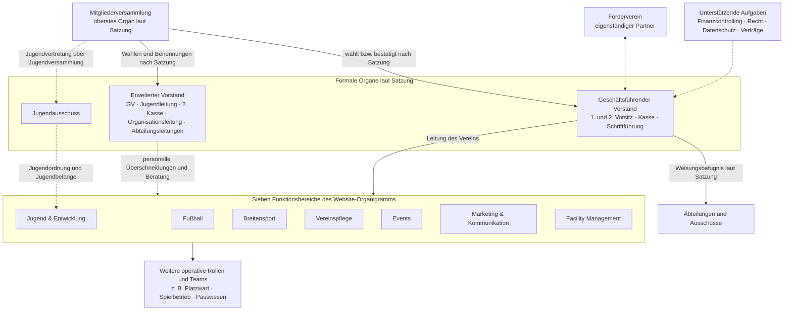
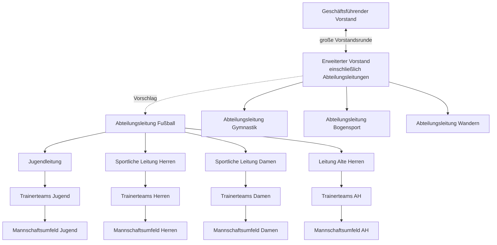

# Organisations- und Kommunikationsmodell

**Status:** Faktengrundlage mit einem noch zu beratenden Arbeitsvorschlag

**Quellen:** Vereinssatzung, Stand 31.01.2023; Website-Organigramm, geprüft am 03.09.2026; Klarstellungen und ergänzende Beschreibungen der Kommunikationspraxis vom 02. und 03.09.2026

## Was die vorhandenen Grundlagen sagen

Das folgende Bild verbindet zwei unterschiedliche Perspektiven:

- Die **Satzung** legt die formalen Organe, Zuständigkeiten und Aufsicht fest.
- Das **Website-Organigramm** ordnet die laufende Vereinsarbeit in sieben Funktionsbereiche.

Beide Darstellungen sind richtig, aber nicht deckungsgleich. Insbesondere ist der erweiterte Vorstand im veröffentlichten Organigramm keine eigene Ebene und die operative Ebene mit Trainerteams und weiteren Aufgaben ist dort noch nicht vollständig dargestellt.

Die gestrichelten Verbindungen kennzeichnen Beziehungen, die nicht als einfache Weisungslinie zu verstehen sind. Das Diagramm ist keine neue Geschäftsordnung und begründet keine bislang nicht beschlossenen Befugnisse.

## Arbeitsmodell für die interne Kommunikationskette

**Beobachtung, ergänzt am 03.09.2026:** In der großen Vorstandsrunde beraten der geschäftsführende Vorstand und die weiteren Mitglieder des erweiterten Vorstands einschließlich der Abteilungsleitungen. Die Weitergabe verbindlicher Informationen erfolgt anschließend von Ebene zu Ebene. Die Abteilungsleitungen organisieren den Informationsfluss innerhalb ihrer jeweiligen Abteilung.

Die Pfeile von oben nach unten zeigen die Weitergabe von Informationen. Rückmeldungen, Bedarfe und Eskalationen laufen über dieselben Ebenen in umgekehrter Richtung. Die Abteilungsleitung Fußball ist ein Vorschlag und keine bestehende oder beschlossene Funktion. Ihre formale Einordnung und die genaue Besetzung der großen Vorstandsrunde sind noch zu klären.

## Noch zu vervollständigen

Für ein belastbares Ziel-Organigramm fehlen derzeit insbesondere:

- die Entscheidung über eine Abteilungsleitung Fußball einschließlich Auftrag, Wahl beziehungsweise Benennung und Entscheidungsspielraum,
- die formale Zuordnung von Jugendleitung, sportlichen Leitungen Herren und Damen sowie der Leitung der Alten Herren,
- die benannten Trainerteams und nachgelagerten Empfängerkreise je sportlichem Bereich,
- benannte Gesamtverantwortliche und Stellvertretungen je Funktionsbereich,
- das genaue Verhältnis zwischen Website-Funktionsbereichen und erweitertem Vorstand,
- Entscheidungsspielräume der Rollen,
- verbindliche Übergaben und Eskalationswege,
- Kommunikationskanäle und Dokumentationsorte.

Diese Punkte sind Arbeitsauftrag des Schwerpunkts [Interne Kommunikation](../handlungsfelder/interne-kommunikation.md), nicht bereits beschlossene Organisationsänderungen.
