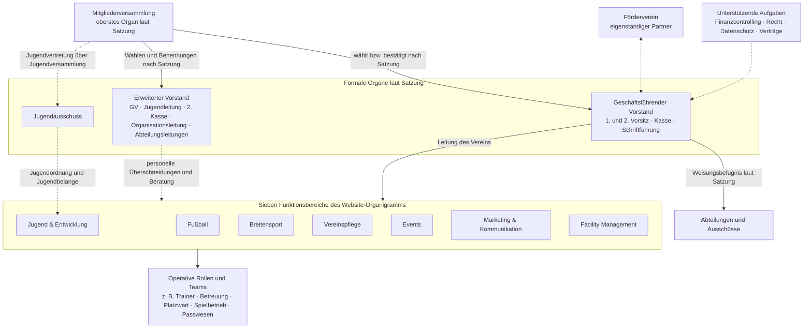
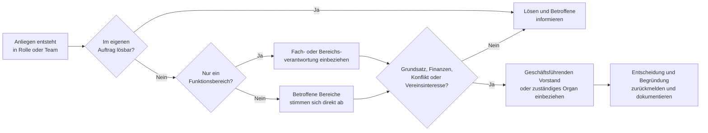

# Organisations- und Kommunikationsmodell

**Status:** Faktengrundlage mit einem noch zu beratenden Arbeitsvorschlag

**Quellen:** Vereinssatzung, Stand 31.01.2023; Website-Organigramm, Stand 02.09.2026; Klarstellung zum Schwerpunkt Interne Kommunikation vom 02.09.2026

## Was die vorhandenen Grundlagen sagen

Das folgende Bild verbindet zwei unterschiedliche Perspektiven:

- Die **Satzung** legt die formalen Organe, Zuständigkeiten und Aufsicht fest.
- Das **Website-Organigramm** ordnet die laufende Vereinsarbeit in sieben Funktionsbereiche.

Beide Darstellungen sind richtig, aber nicht deckungsgleich. Insbesondere ist der erweiterte Vorstand im veröffentlichten Organigramm keine eigene Ebene und die operative Ebene mit Trainerteams und weiteren Aufgaben ist dort noch nicht vollständig dargestellt.

Die gestrichelten Verbindungen kennzeichnen Beziehungen, die nicht als einfache Weisungslinie zu verstehen sind. Das Diagramm ist keine neue Geschäftsordnung und begründet keine bislang nicht beschlossenen Befugnisse.

## Vorgeschlagener Weg für die tägliche Kommunikation

**Vorschlag:** Im Alltag soll nicht jede Information über den Vorstand laufen. Zuständige Personen sprechen direkt miteinander; die Hierarchie wird für Verantwortung, Entscheidungen und Eskalation genutzt.

## Noch zu vervollständigen

Für ein belastbares Ziel-Organigramm fehlen derzeit insbesondere:

- die Zuordnung aller Trainer- und Mannschaftsteams,
- benannte Gesamtverantwortliche und Stellvertretungen je Funktionsbereich,
- das genaue Verhältnis zwischen Website-Funktionsbereichen und erweitertem Vorstand,
- Entscheidungsspielräume der Rollen,
- verbindliche Übergaben und Eskalationswege,
- Kommunikationskanäle und Dokumentationsorte.

Diese Punkte sind Arbeitsauftrag des Schwerpunkts [Interne Kommunikation](../handlungsfelder/interne-kommunikation.md), nicht bereits beschlossene Organisationsänderungen.
