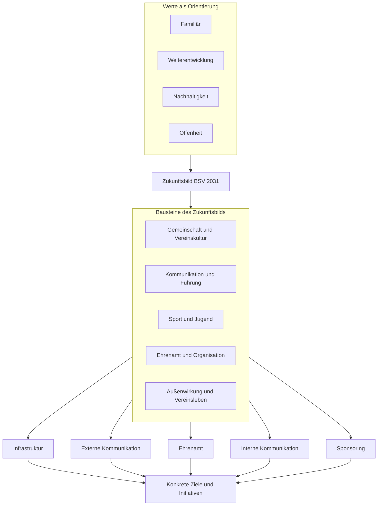

# Strategiearchitektur nach der Strategietagung

Das Diagramm trennt die vier orientierenden Werte, das breite Zukunftsbild und die fünf aktuell priorisierten Arbeitsschwerpunkte. Die Schwerpunktteams sollen daraus konkrete Ziele und Initiativen entwickeln.

