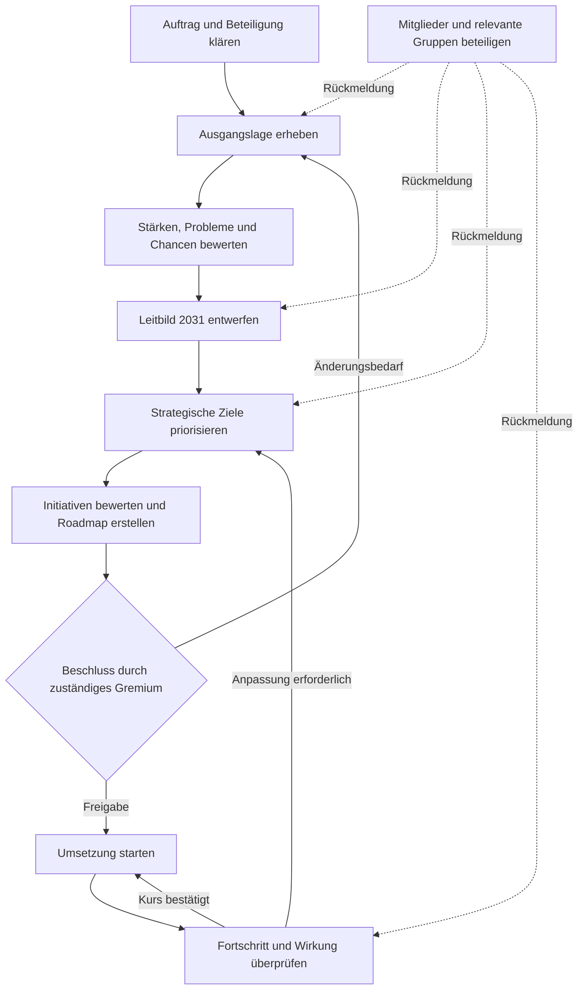

# Strategieprozess

Das Diagramm zeigt den vorgeschlagenen Weg von der Bestandsaufnahme bis zur laufenden Umsetzung. Beteiligung und Rückkopplung finden nicht nur einmalig, sondern über den gesamten Prozess statt.

**Aktueller Stand:** Die Strategietagung vom 16.08.2026 hat Werte, Zukunftsbild und vier Schwerpunkte erarbeitet. Die Schwerpunktteams befinden sich zwischen Priorisierung und Ausarbeitung erster Initiativen. Der nächste gemeinsame Prüftermin ist der 04.10.2026.

