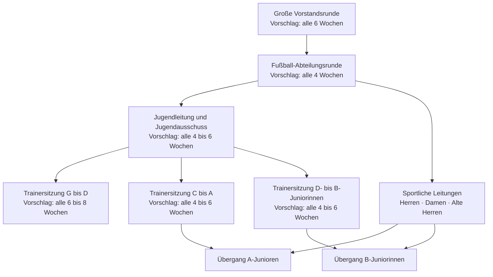

# Kommunikationsformate und Rhythmen

**Status:** Arbeitsentwurf zur Beratung im Schwerpunktteam

**Einordnung:** Die bestehenden regelmäßigen Treffen sind als Beobachtung dokumentiert. Die konkreten Zeitabstände sind Vorschläge und noch durch die zuständigen Gremien und Bereiche festzulegen.

Zurück zur [Übersicht Interne Kommunikation](../interne-kommunikation.md).

## Warum der Rhythmus wichtig ist

**Vorschlag:** Ein Kommunikationsweg ist nur verlässlich, wenn neben Rollen und Kanälen auch geklärt ist, wie häufig ein Austausch stattfindet. Zu seltene Treffen erzeugen Informationslücken und späte Eskalationen. Zu viele Treffen belasten das Ehrenamt und wiederholen Informationen ohne zusätzlichen Nutzen.

**Fakt, Vereinssatzung Stand 31.01.2023, §§ 13 und 14:** Der geschäftsführende Vorstand ist einzuberufen, sooft die Lage der Geschäfte dies erfordert oder ein Vorstandsmitglied es beantragt. Ein fester kalendarischer Abstand wird nicht vorgegeben. Über Sitzungen des geschäftsführenden und des erweiterten Vorstands ist jeweils ein Protokoll zu erstellen. [Quelle: Vereinssatzung des BSV Nordstern](https://bsvnordstern.de/dokumente/bsv-nordstern-satzung-2023.pdf)

Der Rhythmus richtet sich deshalb nach der Art des Themas:

| Art des Themas | Vorgeschlagene Reaktions- oder Austauschlogik |
| --- | --- |
| Gefahr, Schutzfall oder akute Betriebsstörung | unverzüglich über den dafür festgelegten Melde- oder Eskalationsweg |
| Dringende operative Änderung | sofort an die betroffenen Rollen; dauerhafte Folgen anschließend dokumentieren |
| Laufende sportliche und organisatorische Abstimmung | in einem kurzen, festen Rhythmus innerhalb des verantwortlichen Bereichs |
| Bereichsübergreifende Steuerung | regelmäßig in der großen Vorstandsrunde |
| Strategie und Jahresplanung | an festgelegten Planungs- und Überprüfungsterminen |

## Beobachtete und vorgeschlagene Formate

| Format | Beteiligte Rollen | Hauptzweck | Beobachteter Stand | Vorschlag für den Zielrhythmus |
| --- | --- | --- | --- | --- |
| Große Vorstandsrunde | geschäftsführender Vorstand sowie weitere Mitglieder des erweiterten Vorstands einschließlich Abteilungsleitungen | vereinsweite Lage, Beschlüsse, Ressourcen, Abhängigkeiten und Eskalationen | findet regelmäßig statt; genauer Rhythmus nicht dokumentiert | alle sechs Wochen sowie anlassbezogen bei dringendem Entscheidungsbedarf |
| Fußball-Abteilungsrunde | vorgeschlagene Abteilungsleitung Fußball, Jugendleitung, sportliche Leitungen Herren und Damen, Leitung Alte Herren sowie bei Bedarf Spielbetrieb und Passwesen | fußballspezifische Abstimmung und Vorbereitung eines gebündelten Berichts für die große Vorstandsrunde | eine übergeordnete Abteilungsleitung Fußball fehlt im Organigramm | während der Saison alle vier Wochen; zusätzlich vor Saisonbeginn und zum Übergang in die Rückrunde |
| Jugendleitung und Jugendausschuss | Jugendleitung, stellvertretende Jugendleitung und Jugendausschuss einschließlich Jugendvertretungen gemäß geltender Ordnung | Feedback der Jugendvertretungen, Jugendevents, Jugendbelange und Vorbereitung notwendiger Entscheidungen | findet regelmäßig statt; genauer Rhythmus nicht dokumentiert | alle vier bis sechs Wochen und zusätzlich vor größeren Jugendevents |
| Trainersitzung G- bis D-Junioren | zuständige Jugendleitung oder Koordination sowie Trainerteams G bis D | Kinderfußball, Trainingsorganisation, Platz- und Materialthemen sowie altersbezogene Übergänge | findet regelmäßig statt; genauer Rhythmus nicht dokumentiert | alle sechs bis acht Wochen während der Saison sowie vor dem Saisonstart |
| Trainersitzung C- bis A-Junioren | zuständige Jugendleitung oder Koordination sowie Trainerteams C bis A | sportliche Entwicklung, Kaderübergänge und Integration in den Herrenbereich | findet regelmäßig statt; genauer Rhythmus nicht dokumentiert | alle vier bis sechs Wochen; für den Übergang der A-Junioren bei Bedarf häufiger |
| Trainersitzung D- bis B-Juniorinnen | zuständige Jugendleitung oder Juniorinnenkoordination sowie Trainerteams D bis B | Entwicklung des Mädchenfußballs, Kaderübergänge und Integration in den Damenbereich | findet regelmäßig statt; genauer Rhythmus nicht dokumentiert | alle vier bis sechs Wochen; für den Übergang der B-Juniorinnen bei Bedarf häufiger |
| Übergangsrunde A-Junioren und B-Juniorinnen | Jugendleitung, sportliche Leitungen Herren und Damen, beteiligte Trainerrollen, Schutzverantwortliche sowie Jugendvertretung | individuelle und strukturelle Übergänge planen, Risiken erkennen und Bindung beobachten | Integrationsmodell fehlt | mindestens alle vier Wochen während der geplanten Übergangsphase; Beginn spätestens sechs Monate vor dem altersbedingten Wechsel als Vorschlag |
| Jahresplanung | Vorstandschaft und verantwortliche Leitungen | Saison, Veranstaltungen, Ressourcen, Kommunikationsanlässe und Abhängigkeiten gemeinsam vorausplanen | als möglicher Ansatz aus der Strategietagung dokumentiert | einmal jährlich vor der Saison; Überprüfung zum Jahres- oder Rückrundenwechsel |

Die vorgeschlagenen Intervalle sind Ausgangspunkte. Sie werden nach einer Erprobungsphase anhand von Aufwand, Teilnahme, offenen Punkten und verspäteten Informationen angepasst.

## Vorgeschlagene Informationskaskade

Das Diagramm zeigt keine beschlossenen Termine. Es macht sichtbar, dass Informationen aus der großen Vorstandsrunde über die jeweils verantwortlichen Ebenen verteilt und Rückmeldungen für die nächste Sitzung wieder gebündelt werden sollen.

## Vorbereitung und Nachbereitung

**Vorschlag:** Jedes regelmäßige Format folgt demselben einfachen Ablauf:

1. Themen und Entscheidungsbedarf werden vorab gesammelt.
2. Eine Tagesordnung mit Ziel und Zeitrahmen wird verteilt.
3. Die Sitzung unterscheidet Information, Beratung, Aufgabe und Entscheidung.
4. Verantwortliche, Fristen und Empfängerkreise werden festgehalten.
5. Die verantwortlichen Rollen geben relevante Ergebnisse an die nächste Ebene weiter.
6. Offene Punkte und Rückmeldungen werden in die nächste Sitzung übernommen.

Der zugehörige inhaltliche Standard steht unter [Kommunikationsstandard und Stilmittel](02-kommunikationsstandard.md).

## Berichterstattung der vorgeschlagenen Abteilungsleitung Fußball

**Vorschlag:** Falls eine Abteilungsleitung Fußball eingerichtet wird, berichtet sie in der großen Vorstandsrunde gebündelt über:

- wesentliche Entwicklungen in Jugend, Herren, Damen und Alten Herren,
- bereichsübergreifende Platz-, Material- und Terminfragen,
- Themen mit finanzieller oder vereinsweiter Auswirkung,
- Risiken, Konflikte und erforderliche Entscheidungen,
- Übergänge zwischen Jugend- und Erwachsenenfußball,
- Themen, die andere Abteilungen oder Funktionsbereiche betreffen.

Die sportlichen Leitungen und die Jugendleitung bleiben für ihre Bereiche verantwortlich. Die neue Rolle soll Informationen bündeln und Schnittstellen koordinieren, nicht alle Entscheidungen an sich ziehen.

## Offene Fragen

- In welchem Rhythmus finden die bestehenden Formate heute tatsächlich statt?
- Wer nimmt verbindlich an der großen Vorstandsrunde teil?
- Soll nur die vorgeschlagene Abteilungsleitung Fußball oder sollen zusätzlich sportliche Leitungen teilnehmen?
- Wer lädt zu den jeweiligen Sitzungen ein und führt das Ergebnisprotokoll?
- Welche Berichte werden vorab benötigt und welche Kennzahlen sind wirklich hilfreich?
- Wann gilt ein Treffen als entbehrlich und kann durch eine kurze schriftliche Aktualisierung ersetzt werden?
- Nach welchem Zeitraum werden die vorgeschlagenen Rhythmen erstmals überprüft?

## Weiterführende Konzeptbausteine

- [Motive und Führungsprinzipien](01-motive-und-fuehrungsprinzipien.md)
- [Kommunikationsstandard und Stilmittel](02-kommunikationsstandard.md)
- [Räumlichkeiten und digitale Hilfsmittel](03-raeume-und-hilfsmittel.md)
- [Organisations- und Kommunikationsmodell](../../diagramme/interne-kommunikation-organigramm.md)
- [Initiative Übergang A-Junioren und B-Juniorinnen](../../initiativen/uebergang-a-junioren-b-juniorinnen.md)
